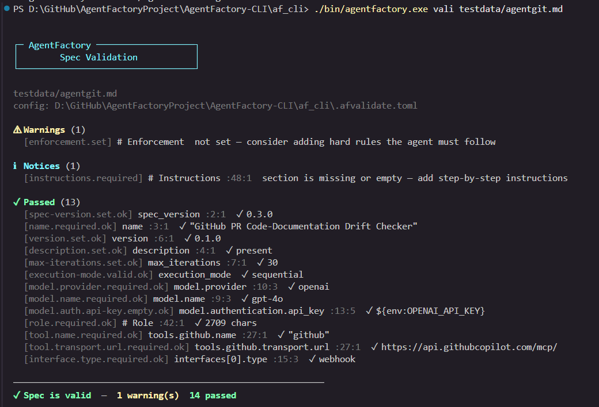
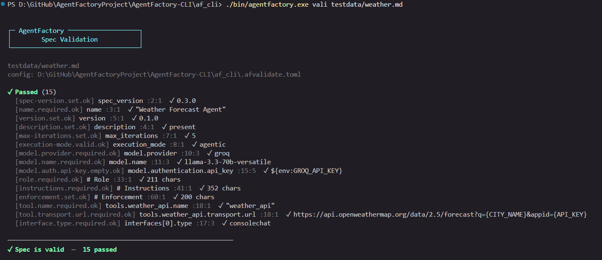
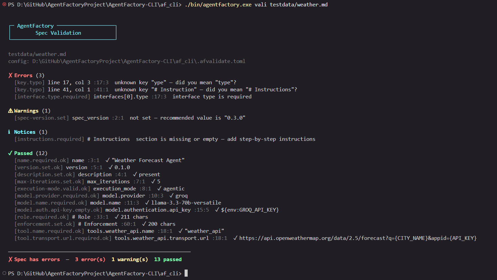
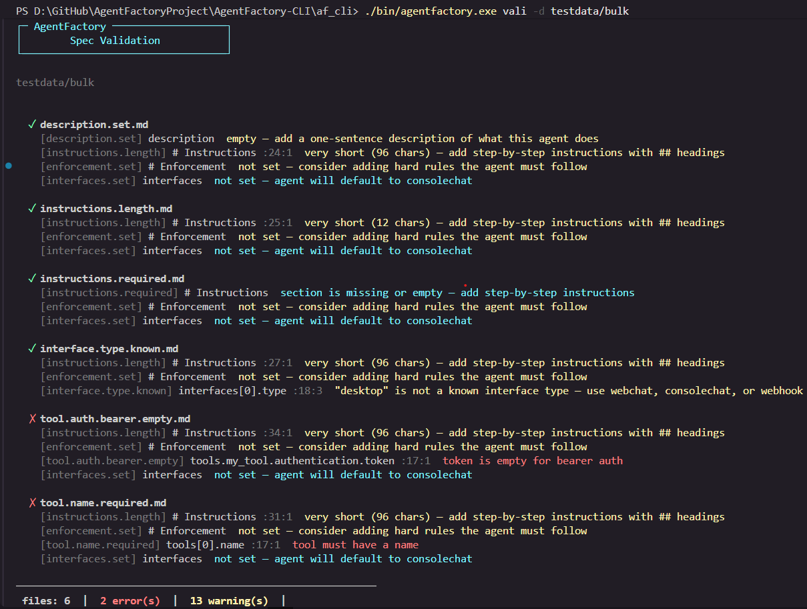
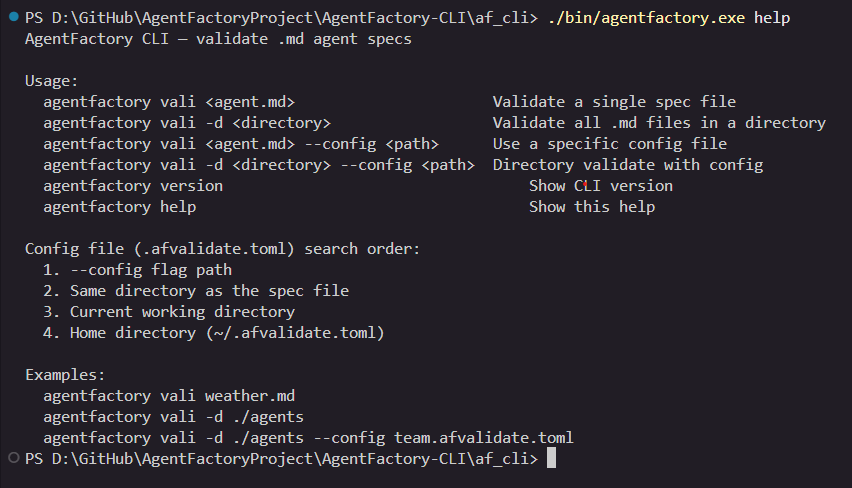
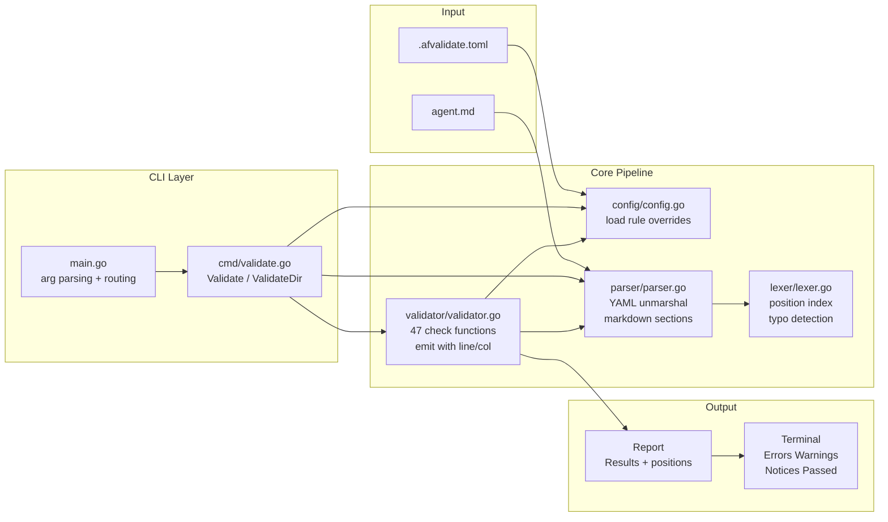
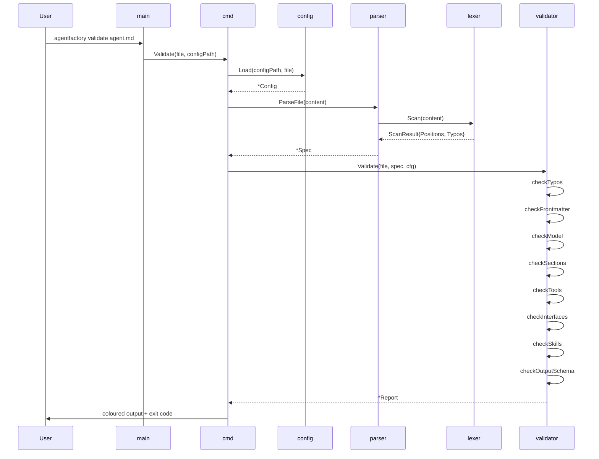

# AgentFactory CLI

> AgentFactory CLI is inspired by [Agent-Flavored Markdown (AFM)](https://wso2.github.io/agent-flavored-markdown/), a specification for defining portable AI agents using Markdown files. This CLI validates those `.md` agent specs — catching errors, typos, and missing fields before you deploy. Special thanks to the authors at WSO2 for introducing and open-sourcing that concept.

A command-line tool for validating AgentFactory `.md` agent spec files.
Catches structural errors, misspelled keys, missing sections, and insecure
credential patterns — before you deploy.

```
agentfactory vali weather.md
agentfactory vali -d ./agents
agentfactory vali weather.md --config team.afvalidate.toml
```

---

## Table of Contents

- [Installation](#installation)
- [Usage](#usage)
- [Output Screen Shots](#output-screen-shots)
- [Architecture](#architecture)
- [Validation Pipeline Sequence](#validation-pipeline-sequence)
- [Package Reference](#package-reference)
- [Validation Rules](#validation-rules)
- [Rule Configuration](#rule-configuration)
- [Typo Detection](#typo-detection)
- [Project Structure](#project-structure)

---

## Installation

**Build from source** (requires Go 1.22+):

```bash
cd AgentFactory-CLI/af_cli
go build -o agentfactory .
```

Move the binary to your PATH:

```bash
# macOS / Linux
mv agentfactory /usr/local/bin/

# Windows — move agentfactory.exe to a folder in your PATH
```

---

## Usage

### Validate a single file

```bash
agentfactory vali agent.md
```

### Validate all `.md` files in a directory

```bash
agentfactory vali -d ./agents
```

### Use a specific config file

```bash
agentfactory vali agent.md --config team.afvalidate.toml
agentfactory vali -d ./agents -c .afvalidate.toml
```

### Other commands

```bash
agentfactory version    # print version
agentfactory help       # show usage
```

---

## Output Screen Shots
### Single file validation






### Validate file bulk


### Help section




| Section      | Meaning                              | Exit code |
| --------------| --------------------------------------| -----------|
| `✗ Errors`   | Spec is broken — must fix            | `1`       |
| `⚠ Warnings` | Should fix, but won't block          | `0`       |
| `ℹ Notices`  | Info-level findings (configurable)   | `0`       |
| `✓ Passed`   | Rules that fired with a clean result | `0`       |

Every finding shows `[rule-id]`, the field name, `:line:col` position, and the message.

---

## Architecture



---

## Validation Pipeline Sequence



---

## Package Reference

### `main`

Entry point. Parses `os.Args`, routes to `cmd.Validate` or `cmd.ValidateDir`.
Handles `--config`/`-c` and `-d` flags.

### `cmd`

| Function | Description |
|---|---|
| `Validate(file, configPath)` | Validate a single `.md` file, print grouped results, exit 1 on errors |
| `ValidateDir(dir, configPath)` | Glob all `*.md` in dir, validate each, print one-line summary per file |

### `config`

Loads `.afvalidate.toml` using a 4-level search order:

1. `--config` flag path
2. Same directory as the spec file
3. Current working directory
4. `~/.afvalidate.toml`

| Function | Description |
|---|---|
| `Load(explicitPath, specFile)` | Find and parse the nearest config file |
| `Config.Resolve(ruleID, default)` | Return effective level for a rule (config override or default) |
| `Config.IsOff(ruleID)` | Return true if the rule is disabled |

### `parser`

Reads a `.md` file, unmarshals YAML frontmatter into `Spec`, and extracts
markdown body sections (`# Role`, `# Instructions`, `# Enforcement`,
`# Output Schema`). Delegates scanning to the lexer.

Key types: `Spec`, `ModelSpec`, `AuthSpec`, `Interface`, `Skill`, `ToolMCP`

### `lexer`

A linear single-pass scanner. Builds a `FieldIndex` (field path → `Position`)
and detects misspelled YAML keys and section headings using Levenshtein
distance matching.

| Function | Description |
|---|---|
| `Scan(content)` | Return `ScanResult{Positions, Typos}` |
| `contextForPath(path)` | Return valid child keys for a parent path |
| `levenshtein(a, b)` | Compute edit distance between two strings |
| `suggestKey(key, validKeys)` | Return closest valid key within edit distance 2 |

### `validator`

Runs 8 check functions against the parsed spec. Every finding goes through
`emit()` which applies the config override and resolves the source position
via `lookupPos()` with parent-path fallback.

Pass confirmations use `.ok`-suffixed rule IDs so config overrides only
affect the problem branch, not the `✓ field is valid` message.

---

## Validation Rules

### Frontmatter

| Rule ID | Default | Description |
|---|---|---|
| `spec-version.set` | warn | `spec_version` is present |
| `spec-version.format` | warn | `spec_version` matches `0.x.x` |
| `name.required` | error | `name` is non-empty |
| `name.length` | warn | `name` is ≤ 80 characters |
| `version.set` | warn | `version` is present |
| `version.semver` | warn | `version` is valid semver |
| `description.set` | warn | `description` is present |
| `max-iterations.set` | info | `max_iterations` is set |
| `max-iterations.min` | error | `max_iterations` ≥ 1 |
| `max-iterations.max` | warn | `max_iterations` ≤ 50 |
| `execution-mode.valid` | error | `execution_mode` is `sequential` or `agentic` |

### Model

| Rule ID | Default | Description |
|---|---|---|
| `model.provider.required` | error | `model.provider` is present |
| `model.provider.known` | warn | Provider is one of: openai, groq, anthropic, google, ollama |
| `model.name.required` | error | `model.name` is present |
| `model.temperature.range` | error | Temperature is between 0.0 and 2.0 |
| `model.auth.set` | warn | `model.authentication` block is present |
| `model.auth.api-key.empty` | error | `api_key` is not empty |
| `model.auth.api-key.hardcoded` | warn | `api_key` uses `${env:VAR}` pattern |
| `model.auth.bearer.empty` | error | Bearer `token` is not empty |
| `model.auth.type.known` | warn | Auth type is `api-key`, `bearer`, or `none` |

### Sections

| Rule ID | Default | Description |
|---|---|---|
| `role.required` | error | `# Role` section is present and non-empty |
| `role.length` | warn | `# Role` is at least 50 characters |
| `role.you-are` | warn | `# Role` contains "you are" |
| `instructions.required` | warn | `# Instructions` section is present |
| `instructions.length` | warn | `# Instructions` is at least 100 characters |
| `enforcement.set` | info | `# Enforcement` section is present |

### Tools

| Rule ID | Default | Description |
|---|---|---|
| `tools.empty` | info | `tools.mcp` list is not empty |
| `tool.name.required` | error | Each tool has a name |
| `tool.transport.required` | error | Each tool has a transport block |
| `tool.transport.url.required` | error | HTTP transport has a URL |
| `tool.transport.command.required` | error | stdio transport has a command |
| `tool.transport.type.required` | error | Transport type is present |
| `tool.transport.type.known` | warn | Transport type is `http` or `stdio` |
| `tool.auth.api-key.empty` | error | Tool `api_key` is not empty |
| `tool.auth.api-key.hardcoded` | warn | Tool `api_key` uses `${env:VAR}` |
| `tool.auth.bearer.empty` | error | Tool bearer `token` is not empty |
| `tool.auth.basic.username` | error | Basic auth `username` is present |
| `tool.auth.basic.password` | error | Basic auth `password` is present |

### Interfaces

| Rule ID | Default | Description |
|---|---|---|
| `interfaces.set` | info | `interfaces` block is present |
| `interface.type.required` | error | Interface `type` is present |
| `interface.type.known` | warn | Type is `webchat`, `consolechat`, or `webhook` |
| `interface.webhook.prompt` | warn | Webhook interface has a `prompt` template |

### Skills

| Rule ID | Default | Description |
|---|---|---|
| `skill.local.path` | error | Local skill has a `path` |
| `skill.remote.url` | error | Remote skill has a `url` |
| `skill.type.required` | error | Skill `type` is present |
| `skill.type.known` | warn | Type is `local` or `remote` |

### Output Schema

| Rule ID | Default | Description |
|---|---|---|
| `output-schema.valid-json` | error | JSON in `# Output Schema` is valid |

### Typo Detection

| Rule ID | Default | Description |
|---|---|---|
| `key.typo` | error | Unknown YAML key or section heading that resembles a known one |

---

## Rule Configuration

Create `.afvalidate.toml` next to your spec file (or in `~/.afvalidate.toml`
for global defaults):

```toml
[rules]
# Upgrade a warning to an error
"model.auth.api-key.hardcoded" = "error"

# Downgrade an error to a warning
"role.required" = "warn"

# Treat as info-level notice
"enforcement.set" = "info"

# Disable completely
"instructions.required" = "off"
```

Each rule accepts: `"error"`, `"warn"`, `"info"`, or `"off"`.

Config file search order (first found wins):

```
1. --config flag path
2. Same directory as the spec file
3. Current working directory
4. ~/.afvalidate.toml
```

---

## Typo Detection

The lexer checks every YAML key and markdown section heading against the
known valid keys for its context. If a key is unknown but within edit
distance 2 of a valid key, it is reported as a `key.typo` error.

**YAML key typos:**

```
✗ Errors (3)
  [key.typo] line 2, col 1   unknown key "spec_versoin" — did you mean "spec_version"?
  [key.typo] line 9, col 3   unknown key "provder" — did you mean "provider"?
  [key.typo] line 15, col 3  unknown key "tpye" — did you mean "type"?
```

**Section heading typos:**

```
✗ Errors (2)
  [key.typo] line 16, col 1  unknown key "# Rolee" — did you mean "# Role"?
  [key.typo] line 22, col 1  unknown key "# Instrutions" — did you mean "# Instructions"?
```

Contexts with typo checking: `root`, `model`, `model.authentication`,
`interfaces[n]`, `tools.mcp[n]`, `tools.mcp[n].transport`,
`tools.mcp[n].authentication`, `tools.mcp[n].query_params[n]`,
`skills[n]`, `memory`.

---

## Project Structure

```
af_cli/
├── main.go                  Entry point — arg parsing, command routing
├── go.mod                   Module: github.com/agentfactory/cli
│
├── cmd/
│   └── validate.go          Validate() and ValidateDir() — output formatting
│
├── config/
│   └── config.go            Load .afvalidate.toml, Resolve() rule levels
│
├── lexer/
│   └── lexer.go             Scan() — position index, typo detection,
│                            Levenshtein distance, valid-key registry
│
├── parser/
│   └── parser.go            ParseFile() — YAML unmarshal + markdown sections
│                            Re-exports lexer types (FieldIndex, Position, TypoHint)
│
├── validator/
│   └── validator.go         Validate() — 8 check functions, emit(), lookupPos()
│
└── testdata/
    ├── weather.md            Example: weather forecast agent
    ├── assistant.md          Example: conversational assistant
    ├── typo-test.md          Fixture: deliberate typos for testing
    ├── heading-typo.md       Fixture: misspelled section headings
    └── rules/               47 fixtures — one per rule ID
        ├── name.required.md
        ├── role.required.md
        ├── model.auth.api-key.hardcoded.md
        └── ...
```

---

## Dependencies

| Package | Version | Purpose |
|---|---|---|
| `gopkg.in/yaml.v3` | v3.0.1 | YAML frontmatter parsing |
| `github.com/BurntSushi/toml` | v1.4.0 | `.afvalidate.toml` config parsing |

No other external dependencies. The Levenshtein implementation, position
indexer, and all validation logic are written from scratch.

---

## Acknowledgements

Inspired by [Agent-Flavored Markdown (AFM)](https://wso2.github.io/agent-flavored-markdown/) by WSO2 — a specification for defining portable AI agents using Markdown files. Special thanks to the WSO2 authors for introducing and open-sourcing that concept.

The core idea — that an AI agent should be fully described by a human-readable, framework-agnostic Markdown file — comes directly from the AFM specification. Special thanks to the authors at WSO2 for introducing and open-sourcing that concept.

---

## Exit Codes

| Code | Meaning |
|---|---|
| `0` | Spec is valid (no errors) |
| `1` | Spec has one or more errors |

---

## License

[MIT](LICENSE)
