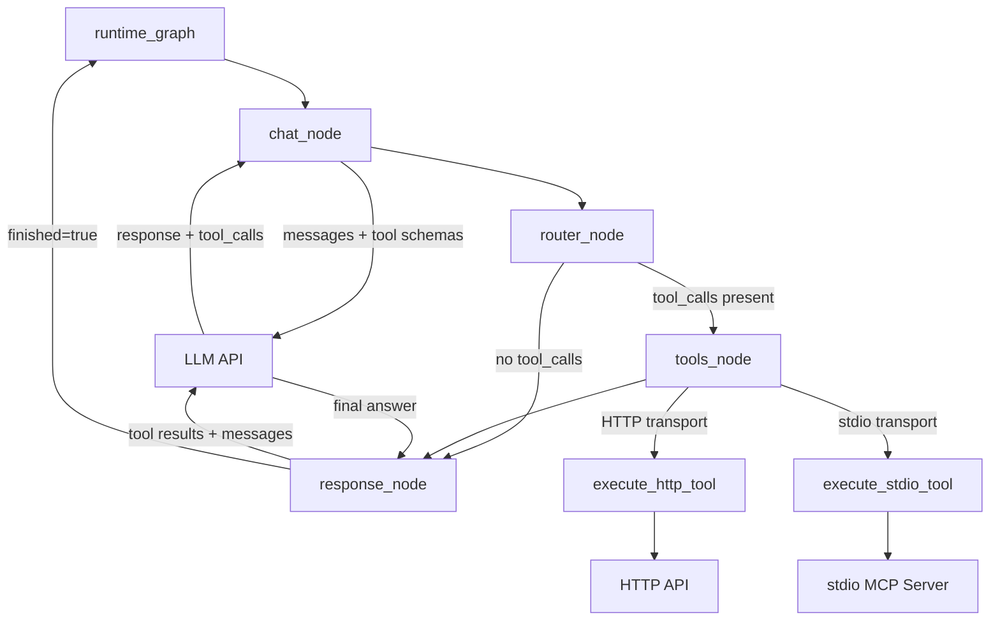
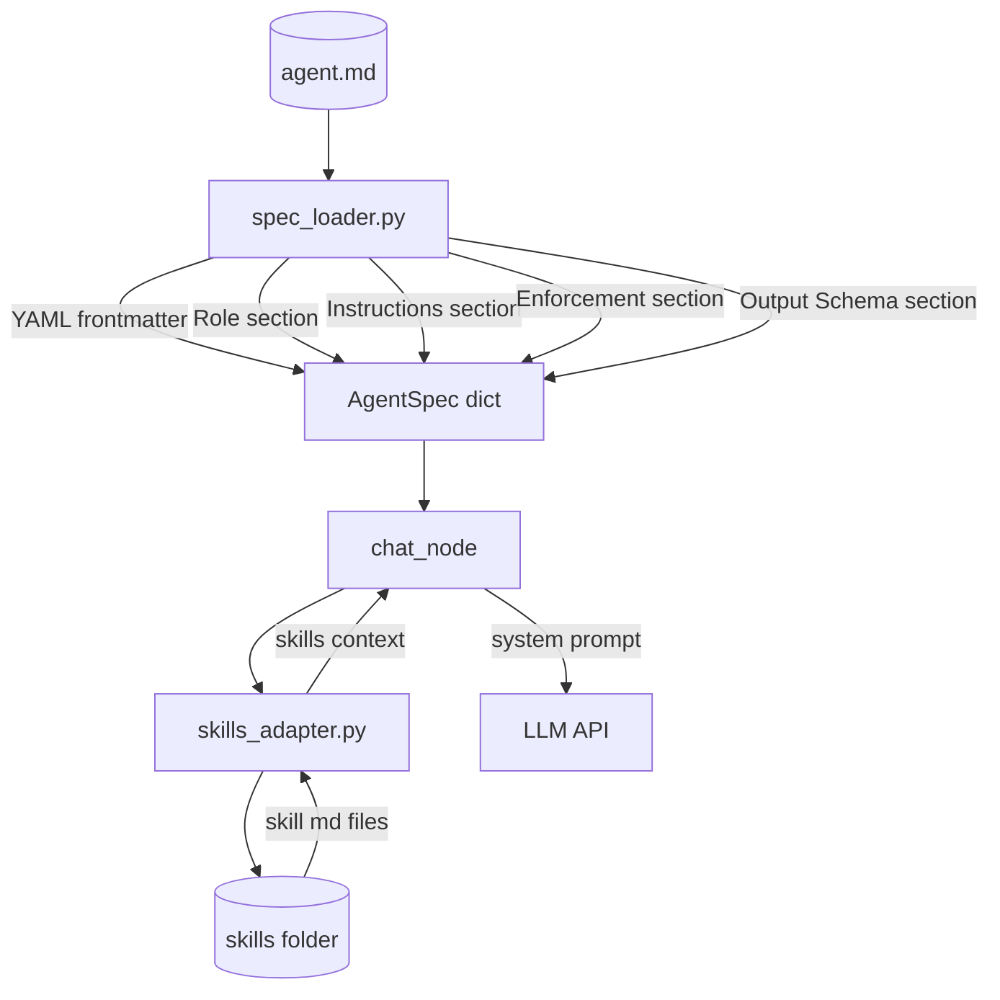
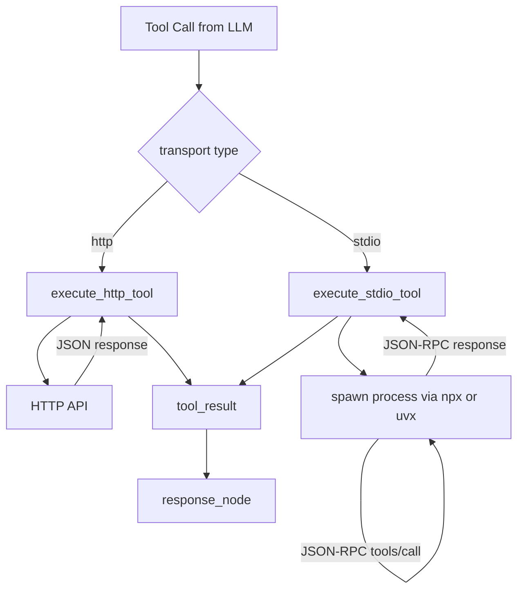
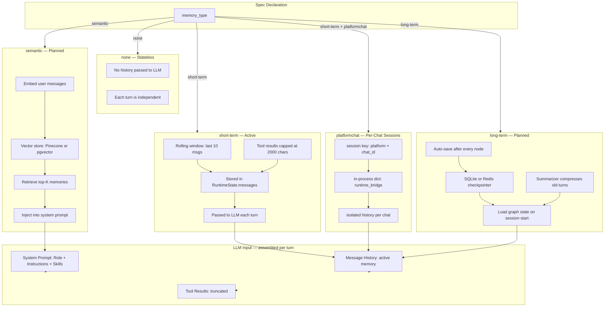

# AgentFactory-CLI Runtime ( Abstract Architecture )

## 1. Top-Level: User to CLI to Python

> The Go binary is the single entry point. It routes `vali`, `run`, and `serve` commands to the appropriate subsystem — the Go validator for spec checking, or the Python runtime bridge for agent execution.

---

## 2. Runtime Graph: LLM and Tools

> The LangGraph `StateGraph` orchestrates each chat turn. The LLM decides whether to call tools or respond directly. Tool results are fed back to the LLM for a grounded final answer before the turn ends.

---

## 3. Spec Loading and Skills

> The spec loader parses the `.md` file into a typed `AgentSpec` dict. Skills are loaded from local markdown files and injected into the LLM system prompt — no code required to add new workflows.

---

## 4. Platform Chat: Telegram

> The `serve` command reads the spec's `platformchat` interface, resolves the bot token from `.env`, and starts either a polling loop or an HTTP webhook handler. Each Telegram chat gets its own isolated session history.

---

## 5. Validation Flow

> Before running, the Go CLI calls the `af_cli` validator binary against the spec file. The validator runs the lexer, parser, and rule engine — checking typos, required fields, auth patterns, and section content — then prints a colored report.

---

## 6. Tool Execution: HTTP vs stdio

> Tools are routed by transport type. HTTP tools make a direct API call. stdio tools spawn an MCP server process (e.g. `npx @modelcontextprotocol/server-filesystem`), perform the JSON-RPC handshake, and call the tool — all transparently.

---

## 7. Memory Architecture

> Memory is declared in the spec via `memory_type`. The runtime implements the active strategy. LangGraph's `StateGraph` is the foundation — state flows through every node as an immutable snapshot, making memory management explicit, testable, and easy to extend.

**Why LangGraph for memory and looping?**

- **Explicit state** — `RuntimeState` is a typed dict passed through every node. Memory is just a field in that dict — no hidden globals, no framework magic.
- **Conditional edges** — the `should_continue` edge lets the graph loop back to `chat_node` for multi-turn agentic workflows, or exit cleanly when `finished=True`.
- **Checkpointing** — LangGraph supports persistent checkpointers (SQLite, Redis) that can save and restore full graph state between turns, enabling long-term memory with zero changes to node logic.
- **Composable** — short-term, long-term, and semantic memory are just different implementations of the same `messages` field. Swapping strategies doesn't change the graph structure.

