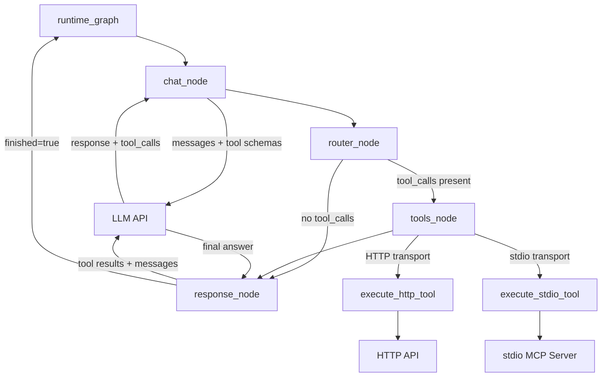
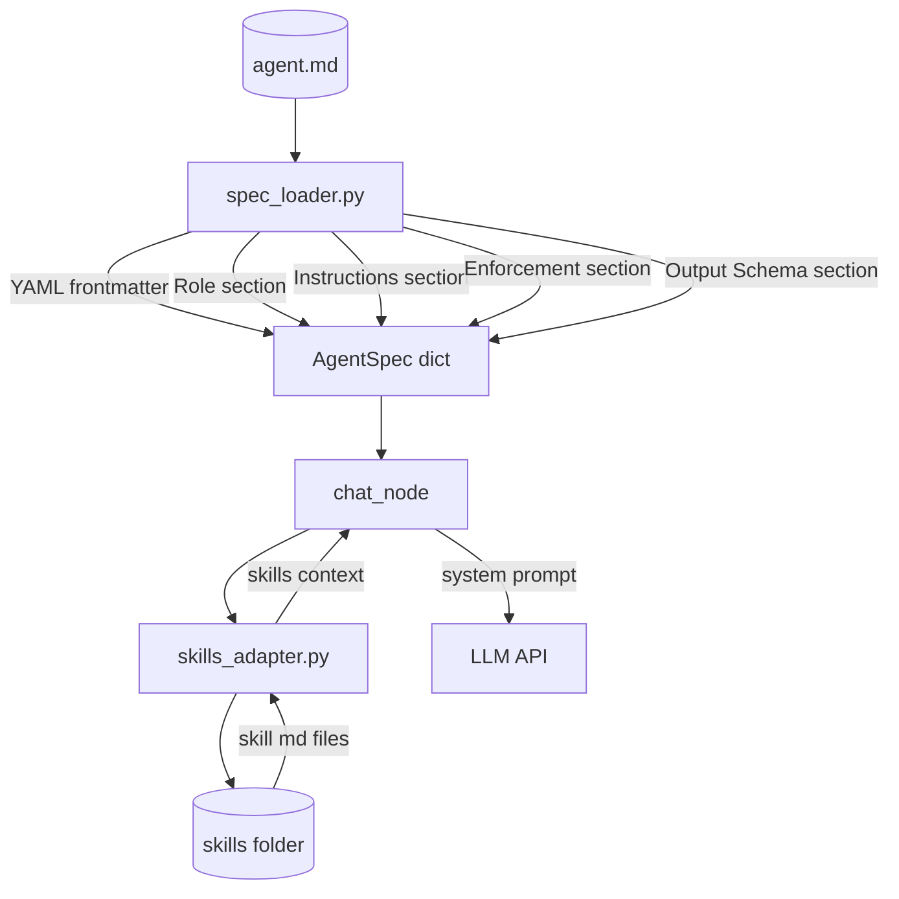
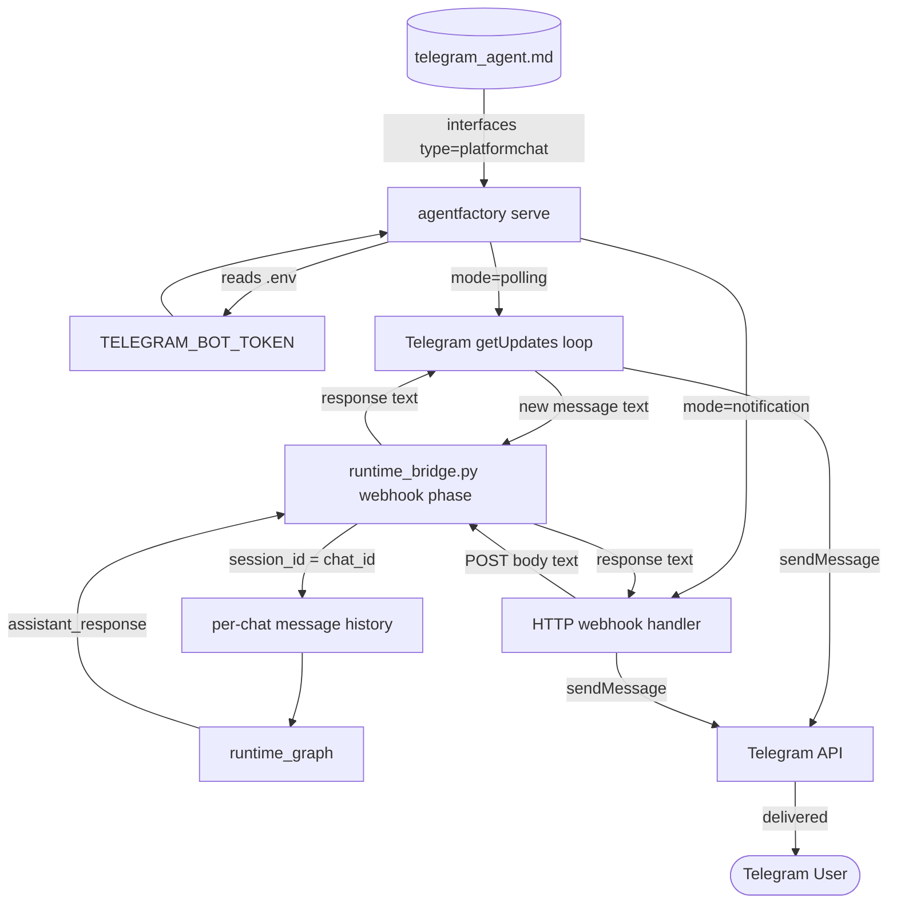
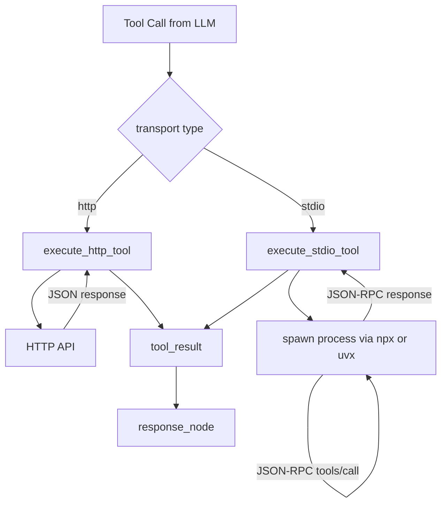
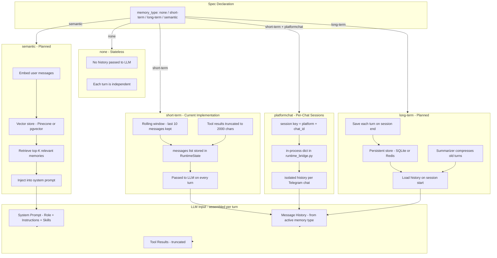

# AgentFactory-CLI ( Abstract Architecture )

## 1. Top-Level: User to CLI to Python

---

## 2. Runtime Graph: LLM and Tools

---

## 3. Spec Loading and Skills

---

## 4. Platform Chat: Telegram

---

## 5. Validation Flow

---

## 6. Tool Execution: HTTP vs stdio

---

## 7. Memory Architecture

