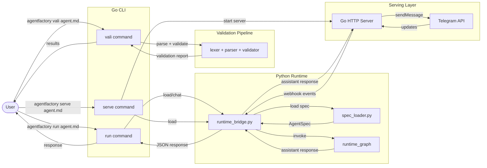
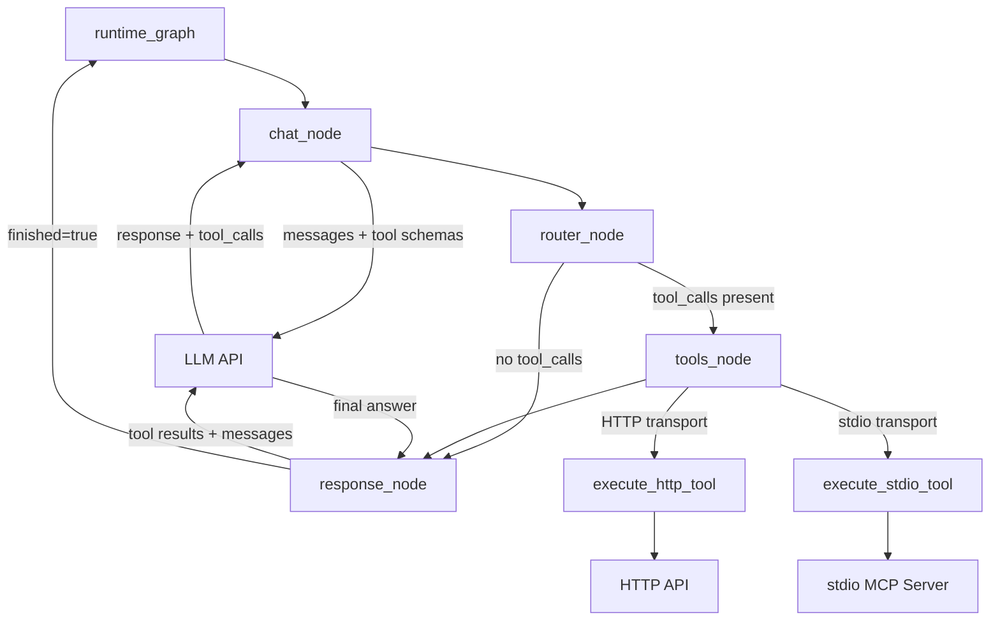
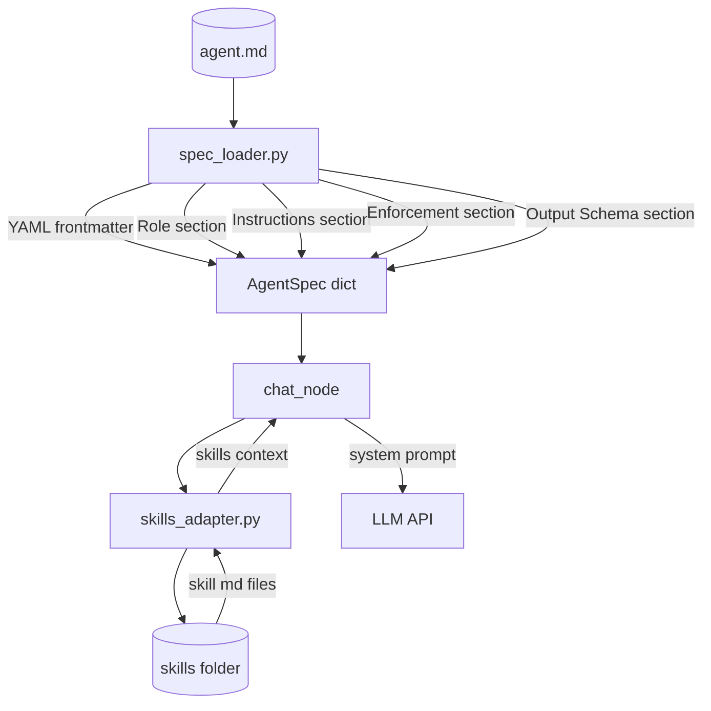
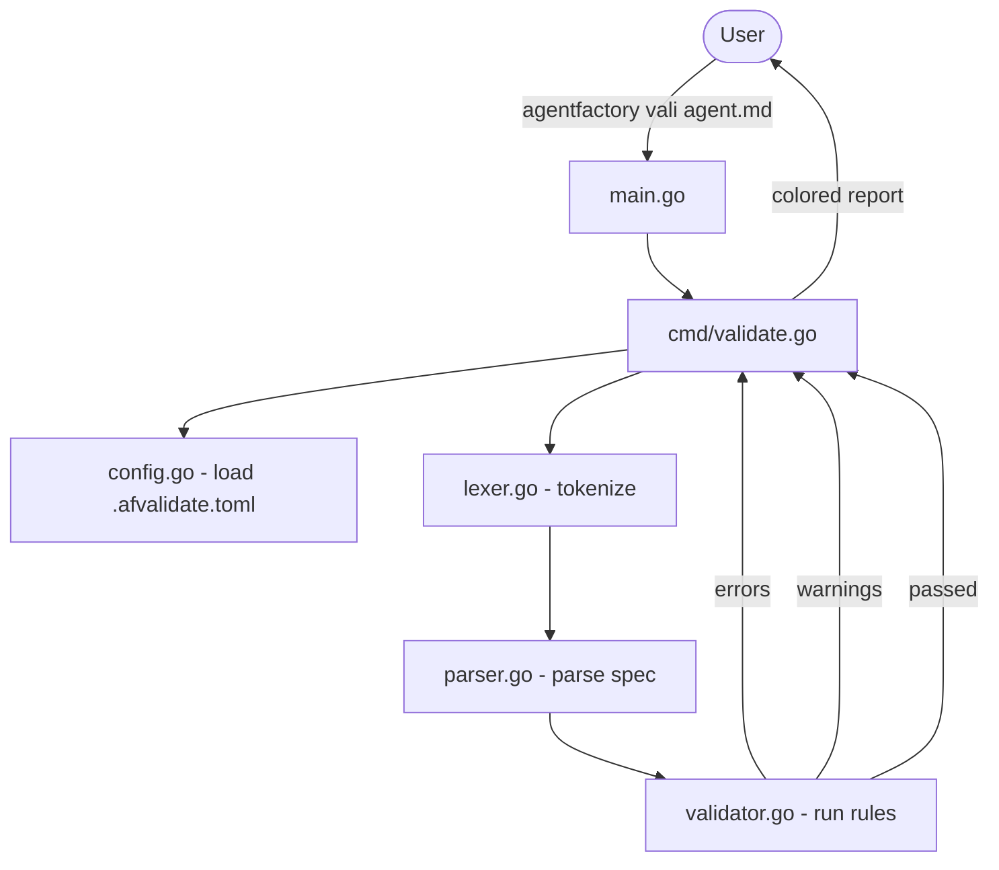
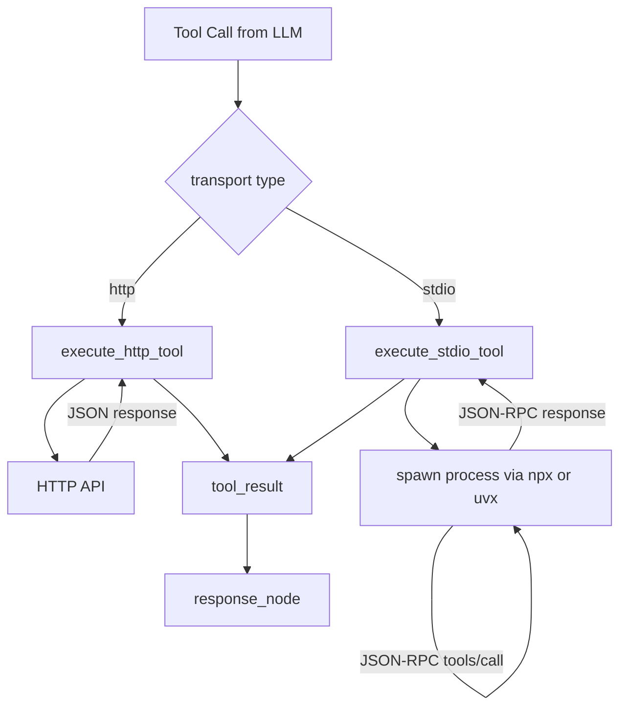
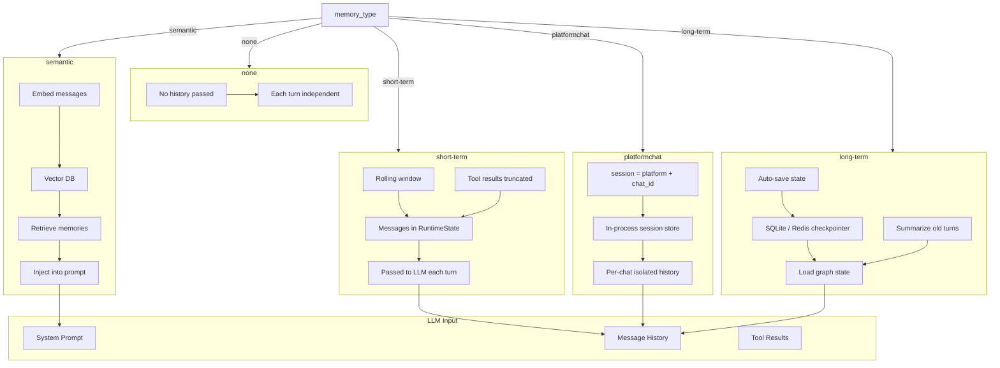

# AgentFactory-CLI Runtime ( Abstract Architecture )

## 1. Top-Level: User to CLI to Python

> The Go binary is the single entry point. It routes `vali`, `run`, and `serve` commands to the appropriate subsystem — the Go validator for spec checking, or the Python runtime bridge for agent execution.



---

## 2. Runtime Graph: LLM and Tools

> The LangGraph `StateGraph` orchestrates each chat turn. The LLM decides whether to call tools or respond directly. Tool results are fed back to the LLM for a grounded final answer before the turn ends.



---

## 3. Spec Loading and Skills

> The spec loader parses the `.md` file into a typed `AgentSpec` dict. Skills are loaded from local markdown files and injected into the LLM system prompt — no code required to add new workflows.



---

## 4. Platform Chat: Telegram

> The `serve` command reads the spec's `platformchat` interface, resolves the bot token from `.env`, and starts either a polling loop or an HTTP webhook handler. Each Telegram chat gets its own isolated session history.


---

## 5. Validation Flow

> Before running, the Go CLI calls the `af_cli` validator binary against the spec file. The validator runs the lexer, parser, and rule engine — checking typos, required fields, auth patterns, and section content — then prints a colored report.



---

## 6. Tool Execution: HTTP vs stdio

> Tools are routed by transport type. HTTP tools make a direct API call. stdio tools spawn an MCP server process (e.g. `npx @modelcontextprotocol/server-filesystem`), perform the JSON-RPC handshake, and call the tool — all transparently.



---

## 7. Memory Architecture

> `memory_type` is set in the YAML frontmatter of the agent spec. `platformchat` session isolation is not a `memory_type` — it activates automatically when `interfaces: [{type: "platformchat"}]` is set, switching the runtime to per-chat session handling.

```yaml
memory_type: "short-term"   # none | short-term | long-term | semantic
```

| Goal | Config |
|---|---|
| Stateless, no history | `memory_type: "none"` |
| Conversational terminal agent | `memory_type: "short-term"` (default) |
| Telegram bot, per-user memory | `interfaces: [{type: "platformchat"}]` |
| Persist memory across restarts | `memory_type: "long-term"` *(planned)* |
| Vector-based recall | `memory_type: "semantic"` *(planned)* |

**Why LangGraph?** `RuntimeState` is a typed dict passed through every node — memory is just a field in that dict. Conditional edges handle looping and exit. Checkpointers (SQLite, Redis) can persist full graph state with zero changes to node logic.

**`none`** — No history passed to the LLM. Every turn is a fresh context. Good for lookup tools, formatters, or one-shot agents where prior messages add noise.

**`short-term`** *(default)* — Last 10 messages kept in `RuntimeState.messages`, passed to the LLM each turn. Tool results truncated to 2000 chars to avoid context bloat. One session per process — all messages in a `run` session belong to the same conversation. History is lost on exit.

**`platformchat`** — Short-term memory extended for multi-user deployments. Sessions keyed by `platform + chat_id` in an in-process dict in `runtime_bridge.py`. Each Telegram chat gets isolated history — concurrent users never mix. Lost on process restart.

**`long-term`** *(planned)* — LangGraph checkpointer persists full graph state to SQLite or Redis. Sessions keyed by `thread_id` — the runtime reloads state on the next turn with the same ID. A summarizer compresses old turns to keep the context window manageable.

**`semantic`** *(planned)* — User messages are embedded and stored in a vector DB (Pinecone, pgvector), namespaced by `user_id`. Each turn retrieves the top-K most relevant past memories and injects them into the system prompt. Best for agents with very long histories where replaying raw messages would overflow context.


